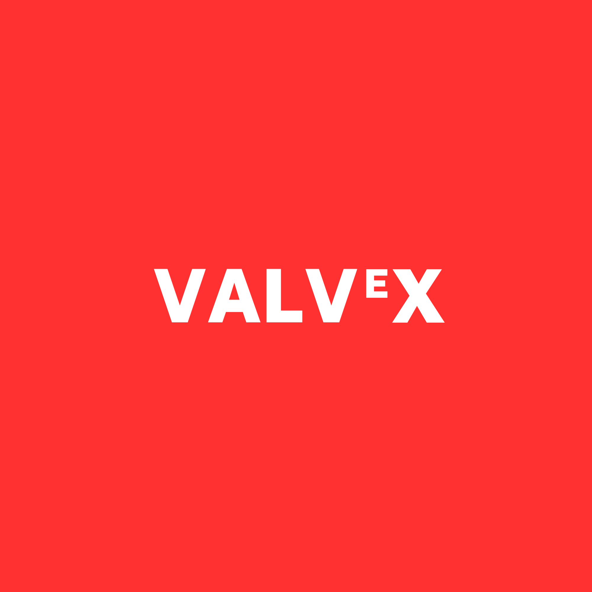
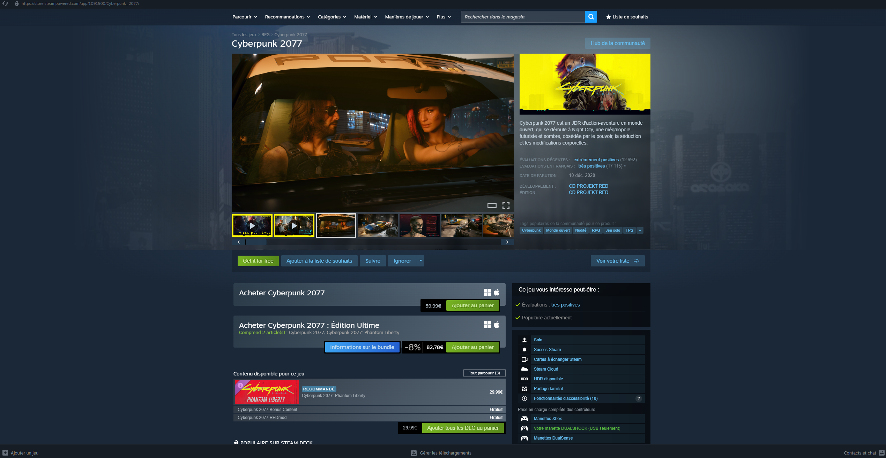

<p align="center">
  
</p>


##
> ⚠️ This project is for educational purposes only. It is not intended for production use. Use at your own risk. ⚠️

VΑLVᴱX is a plugin for managing Steam manifest/lua files. 
It add buttons to the Steam client to allow users to easily downnload and update their lua files.



This project use [LumaCore](https://github.com/KoriaPolis/LumaCore) DLL to handle family-sharing bypass,depot key loading, achievement spoofing, and legacy CD-key suppression. 

It also use [millenium](https://github.com/SteamClientHomebrew/Millennium) to inject functions into the Steam client to add buttons and handle lua file management.

In the future, it will also use [uc-online2](https://github.com/LukeWarmSodas/uc-online2) to spoof your game as Spacewar and allow you to play online with other users.

# How to install

## Automatic installation

You can use the [`download.ps1`](/scripts/download.ps1) script to automatically download and install the plugin.
1. Open PowerShell as Administrator.
2. Enter the following command to run the script: 
```powershell
irm  https://raw.githubusercontent.com/AdrienMttn/ValveX/master/scripts/download.ps1 | iex
```
3. The script will download the latest release, extract it, and copy the files to your Steam installation directory.
4. Then launch Steam and go to `Steam` > `Millennium` > `Plugins` > `Check the checkbox to enable the plugin` > `click save the modifications`

## Manual installation

First, download the latest release from the [releases page](https://github.com/AdrienMttn/ValveX/releases/latest)

Then, extract the contents of the zip file you will get the following files:
```
└── ValveX
    |── dwmapi.dll
    |── LumaCore.dll
    |── wsock32.dll
    └── millenium
      |── lib
      |    |── millennium.hhx64.dll
      |    └── millennium.dll
      |── bin
      |    |── millennium.luavm64.exe
      |    └── millennium.crashhandler64.exe
      └── plugins
          └── STEAM_MANIFEST
              └── ...

```
Then, copy the contents of the `ValveX` folder into your Steam installation directory (usually `C:\Program Files (x86)\Steam`).
> ⚠️ Make sure steam is not running when you copy the files. ⚠️

To finish the installation, you need to launch steam then in steam you need to go to :

`Steam` > `Millennium` > `Plugins` > `Check the checkbox to enable the plugin` > `click save the modifications`

Steam will restart and you will be able to use the plugin.

###

# Roadmap
- [x] Add buttons to the Steam client to download and update lua files.
- [ ] Add Script to download the project from the releases page and copy it to the Steam installation directory.
- [ ] Add button to online-fix game with uc-online2.

###

# Thanks to
- > [Midrags](https://github.com/Midrags) for the inspiration with his project [SteaMidra](https://github.com/Midrags/SFF)
- > [LukeWarmSodas](https://github.com/LukeWarmSodas) for his project [uc-online2](https://github.com/LukeWarmSodas/uc-online2)
